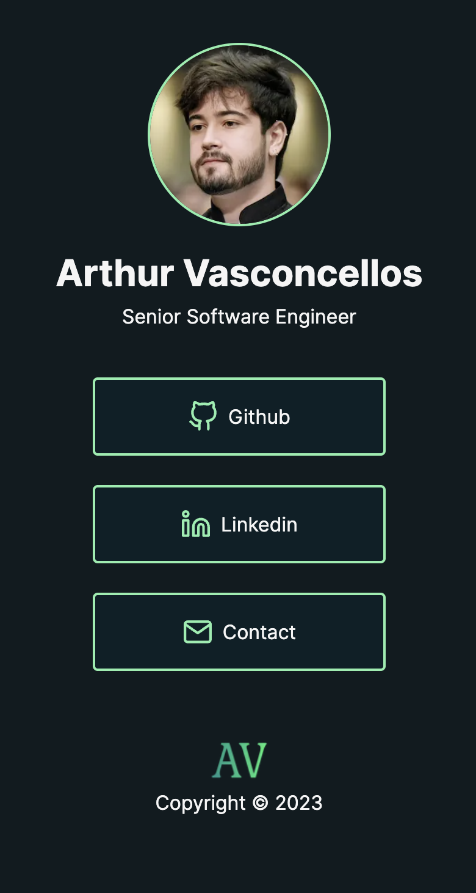

<h1 align="center">arthurvasconcellos.com</h1>

<p align="center">
  <a href="#-project">Project</a>&nbsp;&nbsp;&nbsp;|&nbsp;&nbsp;&nbsp;
  <a href="#-technologies">Technologies</a>&nbsp;&nbsp;&nbsp;|&nbsp;&nbsp;&nbsp;
  <a href="#-running">Running</a>&nbsp;&nbsp;&nbsp;|&nbsp;&nbsp;&nbsp;
  <a href="#-license">License</a>
</p>

<p align="center">
  <a href="#-license">
    
  </a>
</p>

## 💻 Project

Welcome to my professional webpage, a streamlined and easily navigable platform designed to connect you to my professional world with just a click. The website is structured similar to [Linktr.ee](https://linktr.ee/), providing quick access buttons that lead directly to my professional accounts.

<div align="center">
  
</div>

## ✨ Technologies

This project was built using the following technologies:

- [NextJS](https://nextjs.org/)
- [TailwindCSS](https://tailwindcss.com/)
- [TypeScript](https://www.typescriptlang.org/)

## 🟢 Running

Before you get started, ensure your development environment meets the following prerequisites:

- Node.js: Version `18.18.0` or higher
- Yarn: Version `1.22.19` or higher

To run the project locally, follow these steps:

1. **Clone the Repository**: Download the project files by running:

```sh
git clone https://github.com/arthursvpb/arthurvasconcellos.com.git
```

2. **Install Dependencies**: Navigate to the project directory and install the required packages:

```sh
yarn
```

3. **Run the Application**: Start the development server:

```sh
yarn dev
```

This will launch the application, making it accessible via http://localhost:3000/.

## 📝 License

This project is licensed under the MIT License. For more information, please refer to the [LICENSE](LICENSE.md) file.
